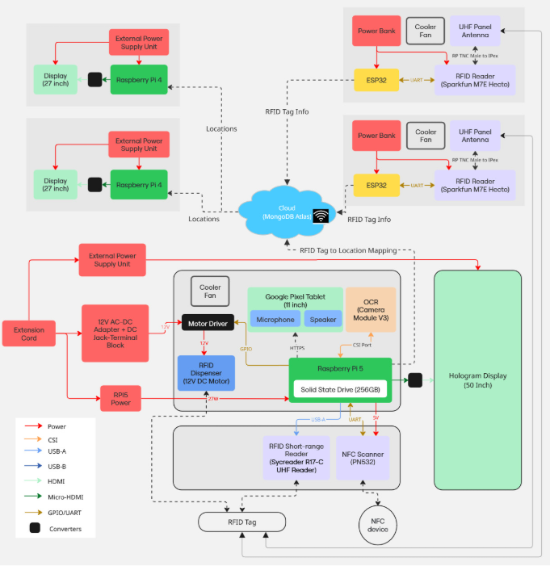
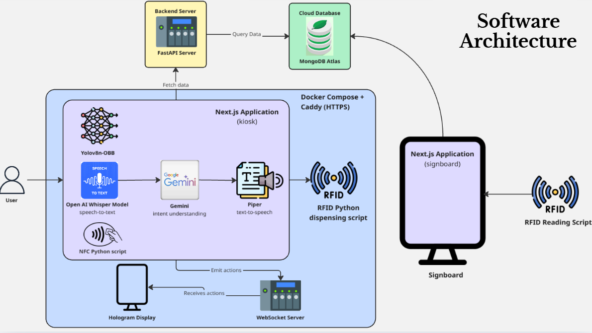
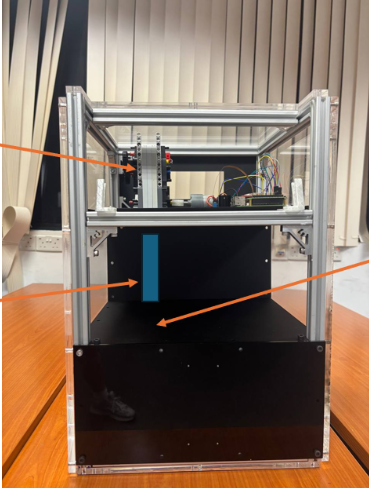
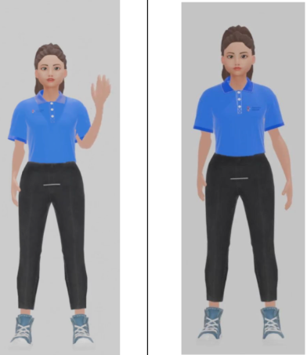
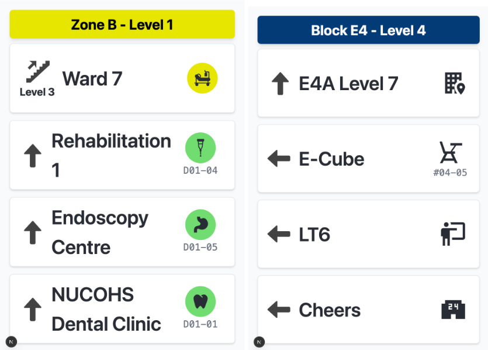
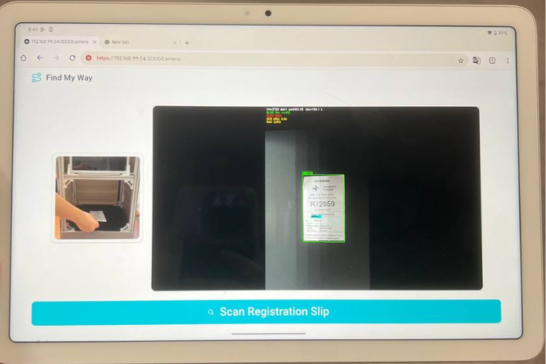
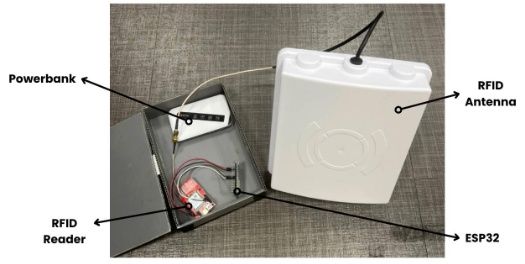

# 📍 Find My Way — Intelligent App-less Indoor Navigation (Alexandra Hospital)

> A Smart Solutions Studio (IS303 / CDE3301) project co-designed with Alexandra Hospital (AH), tested with users across AH and NUS. App-less, human-centric indoor navigation with multimodal assistance.

## 🧭 Overview
Find My Way helps patients—especially seniors—navigate hospital environments without installing any app. The ecosystem combines:
- OCR-based registration slip reading
- Multilingual voice-enabled chatbot (Whisper STT, Gemini LLM, Piper TTS)
- NFC card scanning
- Automatic RFID sticker dispensing
- Smart digital signboards with long-range RFID detection
- Holographic avatar assistance

## ✨ Key Features
- 🧪 OCR Slip Reader — Detects clinic names/locations from registration slips
- 🎙️ Voice-Enabled AI Chatbot — Whisper STT + Gemini LLM + Piper TTS
- 📡 RFID Wayfinding Stickers — Issued automatically to track progress
- 🧲 Long-Range RFID Smart Signboards — Personalized directional prompts
- 🖥️ Holographic Avatar — Audio-visual guidance
- 🛠️ Zero App Required — Elder-friendly design
- 🏥 Real-World Deployment — Actively tested at AH

## 🏗️ System Architecture
- Hardware Architecture  
  
- Software Architecture — Kiosk  
  

## 📸 Screens & Devices (add your own captures)
- 🏗️ Registration Kiosk  
  
- 🕶️ Hologram Avatar  
  
- 🖼️ Smart Digital Signboards  
  
- 🧪 OCR Slip Detection  
  
- 📡 RFID Sticker Dispenser  
  

## 🚀 Technologies
- **Frontend:** Next.js, TailwindCSS, WebSockets, Tablet UI (Pixel Tablet)
- **Backend:** FastAPI, MongoDB Atlas, REST + WS, optional remote GPU for Whisper
- **ML / CV:** YOLOv8-OBB slip detection, OCR preprocessing, Whisper STT, Gemini LLM, Piper TTS
- **Hardware:** Raspberry Pi 5, PN532 NFC reader, ESP32 UHF RFID (long-range), custom friction-based sticker dispenser

## 🏗️ Repository Structure
```
touchscreen-display   # Next.js kiosk UI
server                # WebSocket + FastAPI bridge
chatbot               # Gemini + Chroma RAG + Piper TTS
hologram-display      # Avatar assets
ocr-service           # OCR pipeline
rfid / nfc            # Device integrations
data                  # Vector data & directions CSVs
.chroma               # Chroma persistence
```

## 🧭 Getting Started
- Run everything via Docker Compose: `docker compose up --build`
- For per-service setup, env variables, certs, and vector-store rebuild steps: see `instructions.md`.

## 🔗 Documentation
- Detailed setup, environment variables per folder, and operational steps: `instructions.md`
- Vector data lives in `data/` and `.chroma/ah` (collection `alexandra_hospital`).
